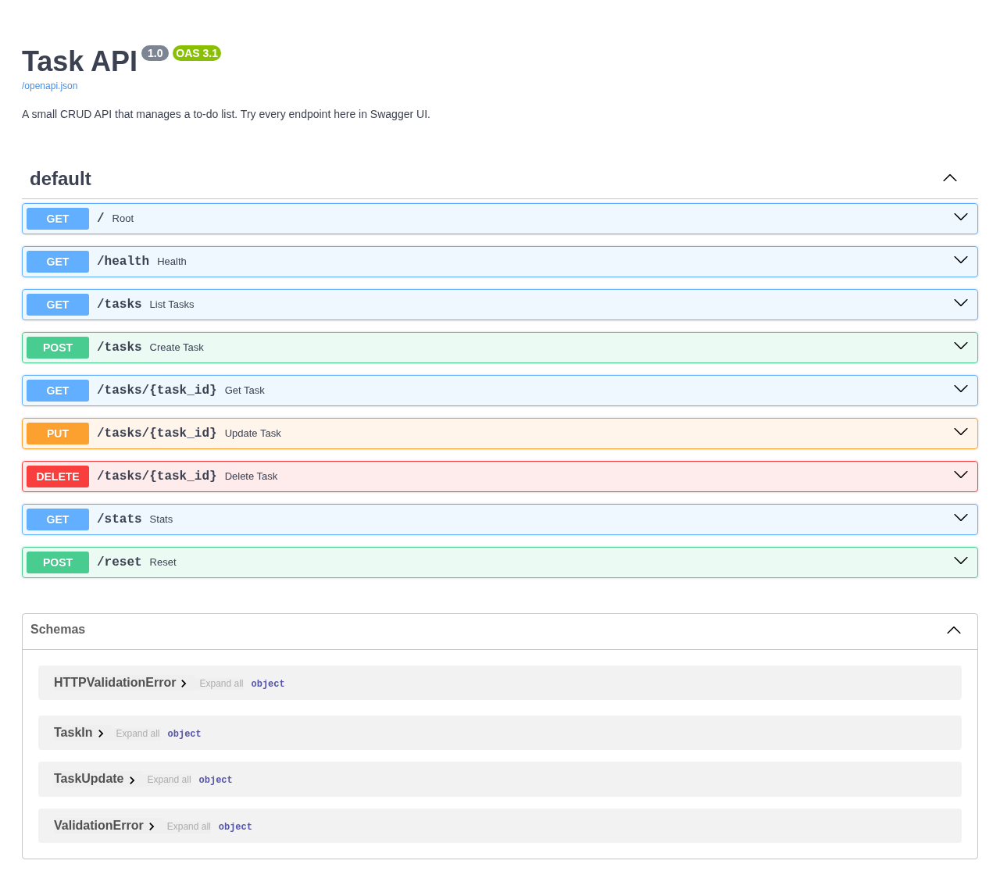

# Task API

A small CRUD API that manages a to-do list, built with FastAPI for the FlyRank internship backend track (Week 2, Assignment A1). Tasks live in memory, so restarting the server resets them to the three seeded examples - that is a feature, not a bug, until databases arrive in Week 3.

## Run it

```bash
python -m uvicorn main:app --reload
```

Then open:

- API docs (Swagger UI): http://localhost:8000/docs
- API root: http://localhost:8000/
- Liveness check: http://localhost:8000/health

## Endpoints

| Method | Path             | What it does                       | Success | Errors                     |
| ------ | ---------------- | ---------------------------------- | ------- | -------------------------- |
| GET    | `/`              | API name, version, endpoints       | 200     | -                          |
| GET    | `/health`        | Liveness signal                    | 200     | -                          |
| GET    | `/tasks`         | List all tasks                     | 200     | -                          |
| GET    | `/tasks?done=`   | Filter by done status              | 200     | -                          |
| GET    | `/tasks?search=` | Search titles                      | 200     | -                          |
| GET    | `/tasks/{id}`    | Get one task                       | 200     | 404 unknown id             |
| POST   | `/tasks`         | Create a task (`{"title": "..."}`) | 201     | 400 missing/empty title    |
| PUT    | `/tasks/{id}`    | Update title and/or done           | 200     | 400 invalid body, 404      |
| DELETE | `/tasks/{id}`    | Delete a task                      | 204     | 404 unknown id             |
| GET    | `/stats`         | total / done / open counts         | 200     | -                          |
| POST   | `/reset`         | Restore the three seed tasks       | 200     | -                          |

## Example request

```bash
curl -i http://localhost:8000/tasks/1
```

```http
HTTP/1.1 200 OK
date: Mon, 03 Aug 2026 17:30:22 GMT
server: uvicorn
content-length: 48
content-type: application/json

{"id":1,"title":"Buy milk","done":false}
```

## Swagger UI

Every endpoint can be exercised with "Try it out" at `http://localhost:8000/docs`:



## AI vs me (Stage 7)

**My prompt.** "Build a small to-do CRUD API in Python with FastAPI. It must store tasks in memory, with no database. Endpoints: GET /tasks returns the whole list, GET /tasks/{id} returns one task or 404 with a JSON error, POST /tasks creates a task with status 201 and returns 400 when the title is missing or empty, PUT /tasks/{id} updates the title and/or the done flag and returns 404 for unknown ids, DELETE /tasks/{id} returns 204 and 404 for unknown ids. Swagger UI must be available at /docs."

**What the AI did better.** Its version was tighter overall - it used a list comprehension to look up tasks and made the request bodies explicit with Pydantic models from the start. I can explain its lookup trick in my own words, and it gave me a cleaner mental model for how FastAPI turns type hints into validation.

**What it got wrong or ignored.** The first generated version returned 200 instead of 201 on create, returned an empty 200 for unknown ids instead of 404, and skipped the empty-title validation entirely - a missing title produced a 500 stack trace. It also silently added SQLite, a database I never asked for, which contradicted the in-memory requirement.

**What my prompt forgot.** I never said what a task object should look like (id/title/done), so the AI invented its own shape; I never said the id must be auto-assigned, and I never mentioned a seed list, so its server started empty. The AI quietly decided all of those for me.

**The rematch.** One re-run with the task shape, auto-id, and seed list specified fixed all of those differences. The lesson: an AI's output is exactly as good as the specification, and I only caught the gaps because I had built the thing myself first.
