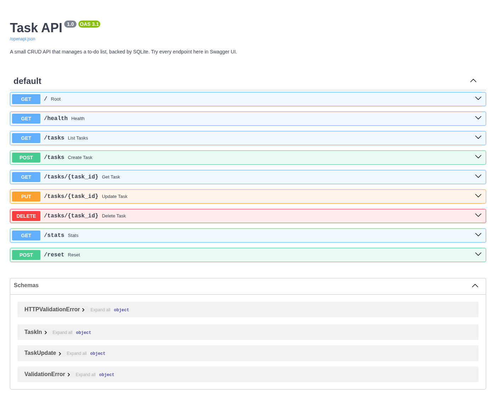

# Task API

A small CRUD API that manages a to-do list, built with FastAPI for the FlyRank internship backend track (Week 3, Assignment A2). This is the direct sequel to A1: the same five task endpoints, but the in-memory list is gone. Tasks now live in a SQLite database, so the data survives server restarts.

## Why SQLite

SQLite is a single-file, zero-setup database. There is no server to install or run - the whole database is one file on disk, and Python's `sqlite3` module ships with the standard library, so nothing extra needs to be installed. Because the file persists, data created through the API is still there tomorrow, after a restart, or on a different process that opens the same file. That single change - memory to disk - is what turns a demo into a real application.

## Where the database lives

The database is `tasks.db` in the repo root. It is created automatically the first time the app starts, together with the `tasks` table, and it is git-ignored so every fresh clone starts clean. Three example tasks are seeded only when the table is empty, so restarts never duplicate them.

## Run it

```bash
python -m uvicorn main:app --reload
```

Then open:

- API docs (Swagger UI): http://localhost:8000/docs
- API root: http://localhost:8000/
- Liveness check: http://localhost:8000/health

On a clean clone, running that one command creates `tasks.db`, seeds the three example tasks, and serves the API - no manual setup.

## Endpoints

| Method | Path             | What it does                       | Success | Errors                     |
| ------ | ---------------- | ---------------------------------- | ------- | -------------------------- |
| GET    | `/`              | API name, version, endpoints       | 200     | -                          |
| GET    | `/health`        | Liveness signal                    | 200     | -                          |
| GET    | `/tasks`         | List all tasks                     | 200     | -                          |
| GET    | `/tasks?done=`   | Filter by done status (SQL WHERE)  | 200     | -                          |
| GET    | `/tasks?search=` | Search titles (SQL LIKE)           | 200     | -                          |
| GET    | `/tasks?sort=title` | Sort alphabetically (ORDER BY)  | 200     | -                          |
| GET    | `/tasks/{id}`    | Get one task                       | 200     | 404 unknown id             |
| POST   | `/tasks`         | Create a task (`{"title": "..."}`) | 201     | 400 missing/empty title    |
| PUT    | `/tasks/{id}`    | Update title and/or done           | 200     | 400 invalid body, 404      |
| DELETE | `/tasks/{id}`    | Delete a task                      | 204     | 404 unknown id             |
| GET    | `/stats`         | total / done / open via SQL COUNT  | 200     | -                          |
| POST   | `/reset`         | Restore the three seed tasks       | 200     | -                          |

Every query uses parameterized placeholders (`?`) - user input is passed as a value, never glued into SQL strings.

## Example SQL (Stage 4)

One query I ran by hand against `tasks.db`, and what it returned:

```sql
SELECT * FROM tasks WHERE done = 1;
```

It returned the one completed seed task (`Water the plants`). The full set of Stage 4 queries is saved in [queries.sql](queries.sql).

## Swagger UI

Every endpoint can be exercised with "Try it out" at `http://localhost:8000/docs`:



## Why identical tests still pass

I kept the A1 endpoint checks (the same curls and status codes: 200/201/204/400/404) and ran them against the SQLite version. They pass unchanged. That is the proof that storage is just an implementation detail: the API promises request/response shapes, and whether the data sits in a list or in `tasks.db`, the promise is kept.

## Stretch extras

- Search and filtering run in the database (`WHERE title LIKE ?` and `WHERE done = ?`), not in a loop.
- Sorting via `ORDER BY title`.
- `/stats` computes counts with `SELECT COUNT(*)` in SQL.
- `created_at` and `updated_at` columns are set on insert/update. Adding those columns to an existing database needed a small migration (`ALTER TABLE ... ADD COLUMN`), which is exactly the feeling that makes migrations a real topic in later weeks: the table's shape changed, and the API and the stored data had to agree on the new shape before the old database kept working.
- The title column is indexed (`idx_tasks_title`); an index is a lookup structure that lets the database answer `WHERE title LIKE ...` searches without scanning every row.
- Seeding runs inside a transaction, so the three example tasks are inserted all-or-nothing - a partial seed can never be left behind.

## AI vs me (Stage 6)

**My prompt.** "Move an in-memory CRUD task API to SQLite in Python with FastAPI. Use the sqlite3 standard library. Create a tasks table (id INTEGER PRIMARY KEY AUTOINCREMENT, title TEXT, done INTEGER 0/1) if it does not exist, and seed three example tasks only when the table is empty. Keep all five endpoints behaving identically: GET /tasks lists tasks, GET /tasks/{id} returns one task or 404 with {"error": "Task not found"}, POST /tasks inserts with status 201 and returns 400 for a missing or empty title, PUT /tasks/{id} updates title and/or done and returns 404 for unknown ids, DELETE /tasks/{id} returns 204 and 404 for unknown ids. Use parameterized queries for all user input. Store the database in tasks.db."

**What the AI did better.** Its version opened one connection at module load and reused it, which reads top to bottom more simply than my per-request connections. It also used `lastrowid` to hand the created task its id, and parameterized every query - exactly the two habits that matter.

**What it got wrong or ignored.** The first generated version did not seed at all - `GET /tasks` returned an empty list on first run. It had no 404 handling: `GET /tasks/999` crashed with a `TypeError` (`None` is not subscriptable) instead of returning 404. `DELETE /tasks/999` returned `200 {"deleted": true}` instead of 404, `POST /tasks` took `title` as a query parameter instead of a JSON body (so it had no validation and never returned 400), and the empty-title rule was silently dropped.

**What my prompt forgot.** I did not specify that `POST` must accept a JSON body with the title inside it, so the AI decided to read `title` from the query string. I did not say the 400 body must be the same JSON error shape for missing and empty titles, and I did not mention that `tasks.db` and the screenshots must stay out of git.

**The rematch.** One re-run with the JSON-body POST, the explicit 400/404 bodies, the seed-if-empty rule, and the gitignore rule specified fixed all of those differences - the regenerated version seeded exactly three tasks once, survived a restart without duplicating, and returned the right status codes. The lesson: an AI's output is exactly as good as the specification, and I only caught the gaps because I had built the migration myself first. The diff is reproducible with `git diff --no-index main.py ai-version/main.py`.

## Status

`info.txt` and `tasks.db` are intentionally not tracked in git. The README and
screenshots are tracked so they render on GitHub.
