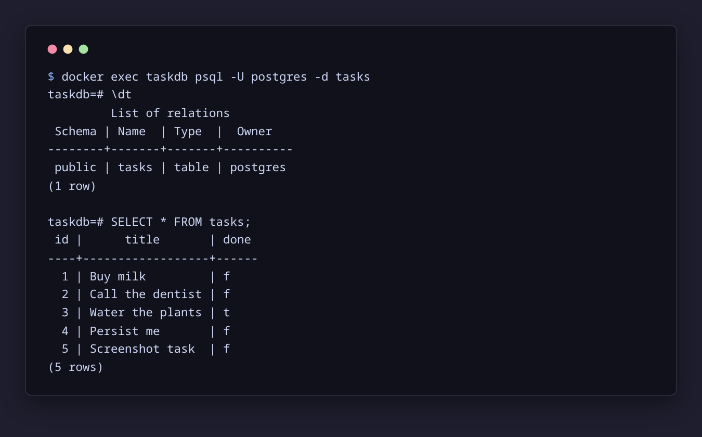
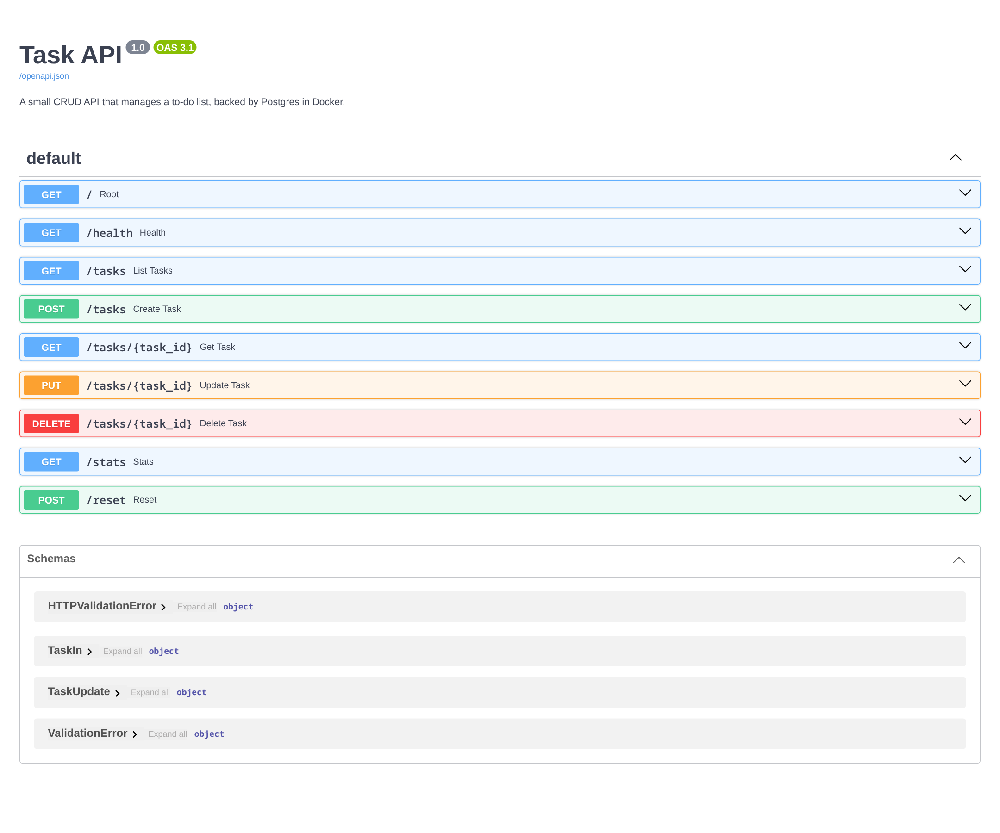

# Task API on Postgres in Docker

The same task CRUD API from A1 (in-memory) and A2 (SQLite), now running
against a real PostgreSQL server in a Docker container. The whole stack - app
plus database - starts with one command.

## Run it

```bash
cp .env.example .env
docker compose up
```

That builds the app image, starts Postgres with a persistent volume, waits for
the database to be healthy, and serves the API at `http://localhost:3000`:

- API docs (Swagger UI): http://localhost:3000/docs
- API root: http://localhost:3000/
- Liveness check: http://localhost:3000/health

On the first run the `tasks` table is created automatically and three example
tasks are seeded - only when the table is empty. Restarts never duplicate them.

## Environment variables

Copy `.env.example` to `.env` and set the values there. The only variable is
`DATABASE_URL`; the real password lives in `.env`, which is git-ignored and
never committed.

## Endpoints

| Method | Path             | What it does                       | Success | Errors                     |
| ------ | ---------------- | ---------------------------------- | ------- | -------------------------- |
| GET    | `/`              | API name, version, endpoints       | 200     | -                          |
| GET    | `/health`        | Liveness signal + DB ping          | 200     | -                          |
| GET    | `/tasks`         | List all tasks                     | 200     | -                          |
| GET    | `/tasks?done=`   | Filter by done status              | 200     | -                          |
| GET    | `/tasks?search=` | Search titles (ILIKE)              | 200     | -                          |
| GET    | `/tasks?sort=title` | Sort alphabetically             | 200     | -                          |
| GET    | `/tasks/{id}`    | Get one task                       | 200     | 404 unknown id             |
| POST   | `/tasks`         | Create a task (`{"title": "..."}`) | 201     | 400 missing/empty title    |
| PUT    | `/tasks/{id}`    | Update title and/or done           | 200     | 400 invalid body, 404      |
| DELETE | `/tasks/{id}`    | Delete a task                      | 204     | 404 unknown id             |
| GET    | `/stats`         | total / done / open counts         | 200     | -                          |
| POST   | `/reset`         | Restore the three seed tasks       | 200     | -                          |

Every query is parameterized (`%s` placeholders, values passed separately), so
user input never gets glued into SQL text.

## Example request

```bash
curl -i http://localhost:3000/tasks
```

```http
HTTP/1.1 200 OK
content-type: application/json

[{"id":1,"title":"Buy milk","done":false},{"id":2,"title":"Call the dentist","done":false},{"id":3,"title":"Water the plants","done":true}]
```

## The data in Postgres

The rows live in the `tasks` table inside the `a3-db-1` container, and the same
data is what every endpoint reads:



Every endpoint can be exercised with "Try it out" at
`http://localhost:3000/docs`:



## Why a containerized database

SQLite was a single file on disk; Postgres is a server that runs as its own
program. Running it as a Docker container makes it identical on every machine,
and the named volume (`taskdata`) keeps the rows alive across
`docker compose down` and `up` - the data survives a full-stack restart.

## Storage swap proof

The endpoint tests from A1/A2 (the same curls and status codes:
200/201/204/400/404) pass unchanged against Postgres. Three storage engines,
one API - storage really is just an implementation detail.

## Extras

- `GET /health` runs `SELECT 1` and reports `{"status":"ok","db":"ok"}` - the
  kind of check real companies gate deploys on. A load balancer uses it to stop
  sending traffic to an unhealthy instance.
- An index on the `done` column with `EXPLAIN ANALYZE` before/after (see
  `queries.sql`): the plan cost drops from 22.50 to 1.05 once the index exists.
- Redis is part of the compose stack and is PINGed once on startup, so the
  wiring is ready for a later week.
- The Dockerfile is multi-stage: dependencies install into a virtualenv in a
  builder stage, and only the runtime stage ships the final image.

## AI vs me (Stage 6)

**My prompt.** "Containerize a task CRUD API onto Postgres with Docker Compose.
Python lane with FastAPI and psycopg. Create a tasks table (id serial primary
key, title text, done boolean) if it does not exist and seed three example tasks
only when the table is empty. Keep all five endpoints behaving identically to
the in-memory/SQLite versions: GET /tasks lists tasks, GET /tasks/{id} returns
one task or 404 with {"error": "Task not found"}, POST /tasks inserts with 201
and returns 400 for a missing or empty title, PUT /tasks/{id} updates title
and/or done and returns 404 for unknown ids, DELETE /tasks/{id} returns 204 and
404 for unknown ids. Use parameterized queries for all user input. The password
comes from .env (never hardcoded), data persists through a volume, and the whole
stack starts with docker compose up."

**What the AI did better.** Its routes are shorter because it skipped the
repository module and talked to Postgres directly - easier to read top to
bottom, even if that is exactly the layer A15 formalizes. It also used
`COALESCE` in the UPDATE, which is a clean way to keep partial updates simple.

**What it got wrong or ignored.** Its compose had no healthcheck and used plain
`depends_on: [db]`, so `docker compose up` crashed: the api container started
before the database was ready and died with a DNS resolution failure. It never
starts reliably first try. It also ignored the empty-title 400 validation
(`title: str` accepts `""`), shipped no `.env`/`.env.example` at all (the secret
workflow is missing, even though it reads the URL from the environment), reused
one connection for the app's whole lifetime, and skipped the extras entirely
(no health endpoint, no index, no Redis, no multi-stage image).

**What my prompt forgot.** I did not say the startup must wait for the database
to be ready (healthcheck + service_healthy), that the connection string must
live in a git-ignored .env with a committed .env.example, or that an empty title
must be rejected with 400. Those were exactly the gaps the AI filled in wrong.

**The rematch.** One re-run with those three rules specified produced a version
that survived the startup race, but it still hardcoded the password. The lesson:
an AI's output is exactly as good as the specification, and I only caught the
gaps because I had built the containerized stack myself first. The diff is
reproducible with `git diff --no-index main.py ai-version/main.py`.
