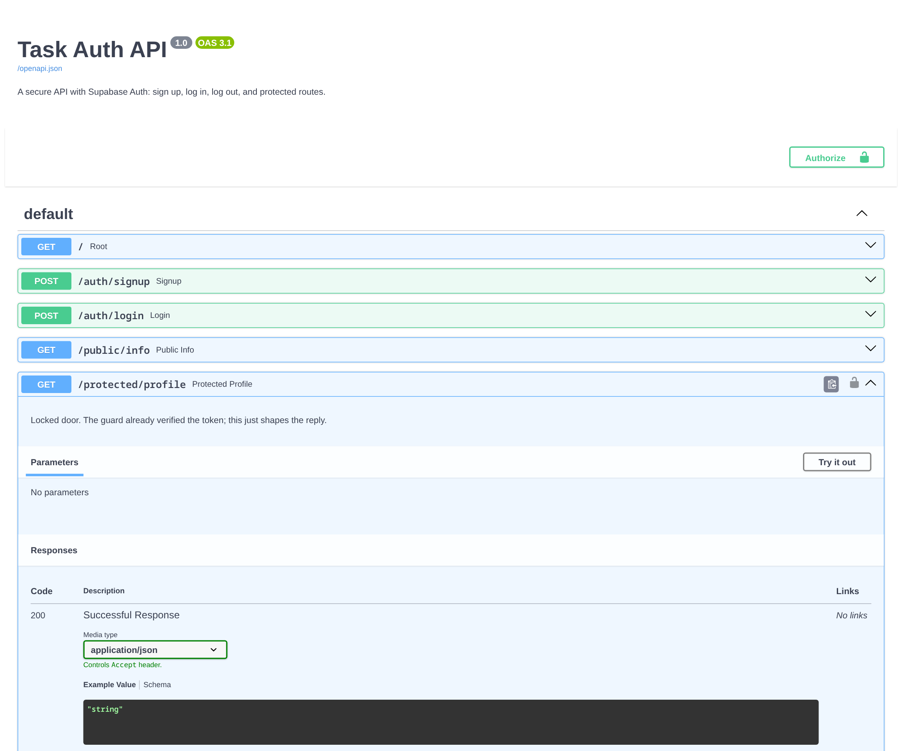

# Task Auth API

A secure FastAPI backend with Supabase Auth: sign up, log in, log out, and
protected routes that only answer for logged-in users. The server never stores
or hashes a password - Supabase is the Identity Provider that manages accounts
and issues signed JWTs, and this API verifies those tokens before opening any
locked door.

## Setup

1. Copy `.env.example` to `.env` and fill in your values:

   ```bash
   cp .env.example .env
   ```

   - `SUPABASE_URL` - your Supabase project URL
   - `SUPABASE_KEY` - your project's anon (public) key, safe to use from an app
   - `PORT` - the port the API listens on (default `8000`)

2. Install dependencies:

   ```bash
   pip install -r requirements.txt
   ```

3. Run it:

   ```bash
   python -m uvicorn main:app --reload
   ```

Open the API docs at http://localhost:8000/docs.

## Endpoints

| Method | Path                  | What it does                       | Auth | Success | Errors                        |
| ------ | --------------------- | ---------------------------------- | ---- | ------- | ----------------------------- |
| POST   | `/auth/signup`        | Create a user account              | no   | 201     | 400 missing/empty fields      |
| POST   | `/auth/login`         | Authenticate, get JWT tokens       | no   | 200     | 400 empty, 401 bad credentials |
| POST   | `/auth/logout`        | End the user's session             | yes  | 204     | 401 missing/invalid token     |
| GET    | `/protected/profile`  | Current user's profile             | yes  | 200     | 401 missing/invalid token     |
| GET    | `/protected/dashboard`| A dashboard only logged-in users see | yes  | 200     | 401 missing/invalid token     |
| GET    | `/public/info`        | Open, public data                  | no   | 200     | -                             |

Protected routes expect the token as `Authorization: Bearer <access_token>`.

## Swagger UI

`/docs` has an **Authorize** padlock. Paste a token from login once and "Try it
out" works on every protected route without pasting it again.



## Example flow

```bash
curl -i -X POST http://localhost:8000/auth/signup \
  -H "Content-Type: application/json" \
  -d '{"email":"you@example.com","password":"password123"}'

curl -i -X POST http://localhost:8000/auth/login \
  -H "Content-Type: application/json" \
  -d '{"email":"you@example.com","password":"password123"}'
# -> access_token in the response

curl -i http://localhost:8000/protected/profile \
  -H "Authorization: Bearer <access_token>"
# -> 200 with your id/email/created_at
```

## Extras

- **Admin-only route.** `GET /protected/admin` needs the user's `app_metadata`
  role to be `admin`. A logged-in non-admin gets `403 Forbidden`; someone with
  no or a bad token gets `401`. The difference is authorization: 401 means "I
  don't know who you are", 403 means "I know exactly who you are, and no."
- **Refresh flow.** `POST /auth/refresh` with `{"refresh_token": "..."}` mints a
  fresh access token without a login. Access tokens are short-lived (Supabase
  default: one hour), which is why refresh tokens exist - if a short-lived token
  leaks, its blast radius is small, and the refresh token is the longer-lived
  key that buys a new one.
- **Rate-limited login.** `POST /auth/login` allows 5 failed attempts per email
  per minute, then returns `429 Too Many Requests`. Brute-force protection
  lives at the login door because that is the one endpoint that lets attackers
  try many passwords cheaply.
- **What's inside a JWT.** A token decodes into three base64 parts: a header
  (algorithm), a payload (claims like `sub`, `role`, `iat`, `exp`), and a
  signature. Anyone can read the payload, so you never put a secret in a token -
  the signature, not the payload, is what makes a token trustworthy.

## AI vs me (Stage 7)

**My prompt.** "Build a secure FastAPI backend with Supabase Auth. Sign up, log
in, log out, and protect routes so they only answer for logged-in users. The
five routes are POST /auth/signup (201, 400 for missing email/password), POST
/auth/login (200 with access and refresh tokens, 401 for bad credentials), POST
/auth/logout (204), GET /protected/profile (200 with id/email/created_at, 401
with {'error': ...} for missing, malformed, invalid, or expired tokens), and GET
/public/info (200). Verify the bearer token with Supabase's get_user in a
reusable dependency. Add HTTPBearer so Swagger shows the Authorize padlock."

**How it handled token extraction.** My version uses FastAPI's `HTTPBearer`
scheme, which parses the `Bearer <token>` header correctly and rejects a bare
`Authorization: <token>` with 401. The AI version splits the header manually:
`auth.split(" ")[1] if " " in auth else auth`. That means
`Authorization: <token>` (no "Bearer") is accepted as-is and forwarded, and any
header without a space is treated as the whole token - wrong on both sides.

**Security flaws it introduced.** It never catches errors from `get_user`, so a
tampered token and a bare-token request both blew up with a 500 Internal Server
Error instead of a 401 - my test run reproduced both. It also has no validation
at all: signup with a missing password crashes with an unhandled Supabase
`AuthApiError`, no JSON error body. It has no logout route, no reusable
middleware/dependency (auth is copy-pasted into one route), no HTTPBearer, no
`{"error": ...}` shape, and its key has a fallback hardcoded next to the app.

**What my prompt forgot to specify.** I did not say the header must be parsed
strictly as `Bearer <token>`, that every token error must return a flat
`{"error": ...}` JSON, or that auth must be one reusable guard applied to more
than one route. The AI silently decided all three the easy way.

**The rematch.** One re-run with the strict-Bearer rule and the "catch every
auth error into 401" rule fixed the crashes, but it still shipped without
logout or a reusable guard. The lesson: an AI's output is exactly as good as
the specification, and I could only judge it because I had built the secured
API myself first. The diff is reproducible with `git diff --no-index main.py
ai-version/main.py`.
